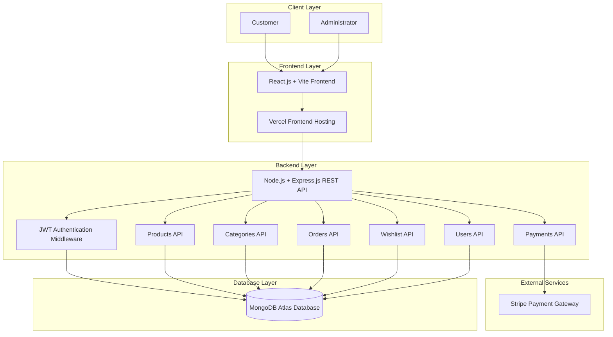

# Project Design Phase
## Solution Architecture

| Field | Value |
|:---|:---|
| **Date** | 30 June 2026 |
| **Team ID** | SMARTBRIDGE-2026 |
| **Project Name** | ShopVerse Platform |
| **Maximum Marks** | 4 Marks |

---

## Solution Architecture Description

Solution architecture explains how the business requirements of **ShopVerse** are converted into a working technical solution. The platform follows a modern **MERN stack architecture** with separate frontend, backend, database, and external service layers. This separation improves scalability, maintainability, security, and deployment flexibility.

ShopVerse is designed as a production-ready e-commerce web application where customers can browse products, manage carts and wishlists, place orders, and complete payments, while administrators can manage products, categories, users, and orders from a centralized dashboard.

---

## Architectural Diagram

---

## Architectural Components & Technologies

| Layer | Component | Description | Technology Stack |
|:---|:---|:---|:---|
| **Client Layer** | Customer & Administrator | End users who access the platform through a web browser | Browser, Internet |
| **Frontend Layer** | User Interface | Responsive customer interface and admin dashboard | React.js, Vite, CSS3, React Router DOM |
| **Frontend Hosting** | Static Web Hosting | Hosts and delivers the frontend application | Vercel |
| **Backend Layer** | REST API Server | Handles business logic, API requests, authentication, and data processing | Node.js, Express.js |
| **Security Layer** | Authentication Middleware | Verifies JWT tokens, protects private routes, and manages role-based access | JWT, Bcrypt |
| **Product Service** | Product Management | Handles product listing, search, filtering, and admin product CRUD operations | Express.js, Mongoose |
| **Category Service** | Category Management | Manages product categories for browsing and admin organization | Express.js, Mongoose |
| **Order Service** | Order Management | Handles order creation, order history, cancellation, and admin status updates | Express.js, Mongoose |
| **Wishlist Service** | Wishlist Management | Allows customers to save and manage favorite products | Express.js, Mongoose |
| **User Service** | User Management | Handles user profiles and admin user management features | Express.js, Mongoose |
| **Payment Service** | Checkout & Payment | Processes secure online payments through Stripe integration | Stripe API |
| **Database Layer** | Data Persistence | Stores users, products, categories, orders, and wishlist information | MongoDB Atlas, Mongoose |
| **Backend Hosting** | API Deployment | Hosts the backend REST API server | Render |

---

## Data Flow Explanation

1. The customer or administrator accesses the ShopVerse frontend through a web browser.
2. The React.js frontend sends API requests to the Express.js backend using RESTful APIs.
3. The backend validates user authentication using JWT middleware.
4. Product, category, user, order, wishlist, and payment requests are routed to their respective API modules.
5. MongoDB Atlas stores and retrieves persistent application data.
6. Stripe Payment Gateway handles secure checkout and payment processing.
7. The backend returns JSON responses to the frontend, which updates the user interface dynamically.

---

## Security Considerations

- User passwords are encrypted using Bcrypt before being stored.
- JWT tokens are used for secure authentication and session management.
- Role-based access control protects administrator-only routes.
- Payment details are handled by Stripe, reducing sensitive payment data exposure.
- Backend APIs validate requests before interacting with the database.
- Environment variables are used to store sensitive keys and database connection strings.

---

## Deployment Architecture

| Component | Deployment Platform |
|:---|:---|
| Frontend Application | Vercel |
| Backend API Server | Render |
| Database | MongoDB Atlas |
| Payment Gateway | Stripe |
| Version Control | GitHub |

---

## Architecture Highlights

- MERN stack architecture for full-stack development.
- Separate frontend, backend, database, and payment layers.
- RESTful API communication between React frontend and Express backend.
- JWT-based authentication and Bcrypt password encryption.
- MongoDB Atlas for scalable cloud database storage.
- Stripe integration for secure payment processing.
- Vercel and Render deployment support for production-ready hosting.
- Modular backend structure for easy maintenance and future enhancements.
- Supports future features such as reviews, coupons, product recommendations, analytics, and email notifications.

---